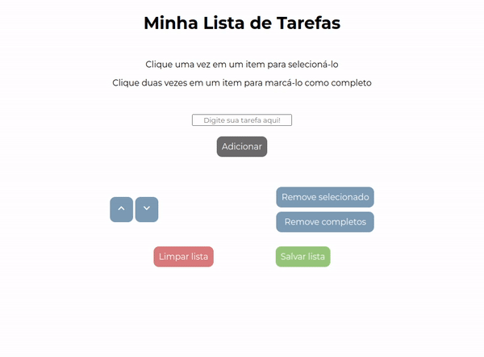

# To Do List

Essa é uma aplicação de lista de tarefas dinâmica, que possibilita o usuário a adicionar e remover itens, alterar suas ordens, marcá-los como concluídos, e salvar a lista para acesso futuro.

O foco dessa projeto foi explorar a manipulação de elementos DOM e os escutadores de eventos.

[Experimente!](https://lzaghi.github.io/to-do-list/)

## Funcionalidades

- Inclusão de itens na lista
- Seleção e manipulação da ordem dos itens na lista
- Marcar itens como concluídos
- Remover itens da lista
- Salvar a lista

## Demonstração




## Tecnologias utilizadas

HTML, CSS, JavaScript, DOM


## Instalação local

1. Clone o repositório 
```bash
  git clone git@github.com:lzaghi/to-do-list.git
```

2. Entre no diretório 
```bash
  cd to-do-list
```

3. Instale as dependências 
```bash
  npm install
```
4. Inicie a aplicação com a extensão Live Server do VSCode


